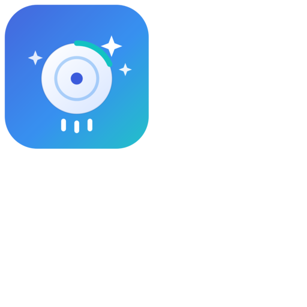

<p align="center">
  
</p>

<h1 align="center">CleanMyMacMCP</h1>

<p align="center">A Swift <a href="https://modelcontextprotocol.io">Model Context Protocol</a> server that helps an AI assistant find and reclaim disk space on macOS.</p>

## Overview

The server exposes read-only inspection tools plus reversible cleanup actions. An MCP client (Claude Desktop, Claude Code, …) uses them to see where disk space is going and to act only on explicit confirmation.

| Tool | Type | Purpose |
|------|------|---------|
| `disk_usage` | read-only | Free/used space for all mounted volumes |
| `directory_sizes` | read-only | Size of each child of a directory, largest first |
| `largest_files` | read-only | Largest individual files under a directory tree |
| `scan_known_junk` | read-only | Sizes of well-known cache / log / build-artifact locations, with a safe-to-delete note |
| `list_time_machine_backups` | read-only | Local APFS Time Machine snapshots per volume |
| `move_to_trash` | destructive | Moves a path to the Trash — **dry run unless `confirm: true`** |
| `delete_time_machine_backup` | destructive | Deletes a local Time Machine snapshot — **dry run unless `confirm: true`** |

## Requirements

- macOS 13+
- Swift 6.2+ toolchain (Xcode 16+)
- [swift-sdk](https://github.com/modelcontextprotocol/swift-sdk) 0.12.1+ (resolved automatically)

## Build

```bash
git clone git@github.com:tkausch/CleanMyMacMCP.git
cd CleanMyMacMCP
swift build -c release
# executable: .build/arm64-apple-macosx/release/cleanmymac-mcp
```

The server speaks MCP over stdio.

## Full Disk Access

Several tools read paths under `~/Library`, which macOS blocks by default. Grant **Full Disk Access**
(**System Settings → Privacy & Security → Full Disk Access**) to whichever process launches the server
(Claude Desktop, Terminal, or the binary). Without it, protected paths report size `0` or are skipped.

## Client Integration

**Claude Desktop** — add to `~/Library/Application Support/Claude/claude_desktop_config.json`, then restart:

```json
{
  "mcpServers": {
    "cleanmymac-mcp": {
      "command": "/absolute/path/to/.build/arm64-apple-macosx/release/cleanmymac-mcp"
    }
  }
}
```

**Claude Code:**

```bash
claude mcp add cleanmymac-mcp --scope user \
  -- /absolute/path/to/.build/arm64-apple-macosx/release/cleanmymac-mcp
```

Use `--scope project` to write a checked-in `.mcp.json`. Inside a session, `/mcp` shows connection status and tools.

## Safety

- Read-only tools only run `df`, `du`, `find` and `stat`; they never modify anything.
- `move_to_trash` is the only mutating tool: dry-run by default, constrained to the user's home directory, and uses the Trash rather than permanent deletion.
- No tool uses `sudo`; everything runs with the launching user's permissions.

## Development

`Sources/CleanMyMacMCP/MCP.swift` holds the server setup and every tool. To add a tool: register a `Tool(...)`
in `createAvailableTools()`, add a `case` in `registerToolCallHandler`, and implement an `execute…Tool`
function returning `CallTool.Result`.

## License

Proprietary. Free for **personal, non-commercial use**; **commercial use
requires a paid license** — contact thomas@kausch.li. See [LICENSE](LICENSE).

Copyright © 2026 Thomas Kausch. All rights reserved.
